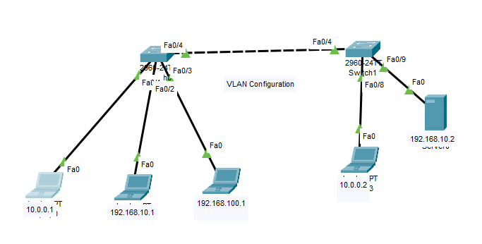
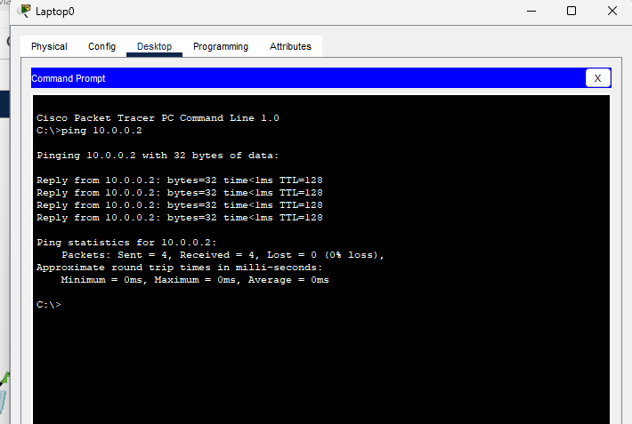
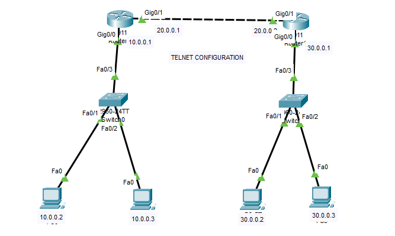
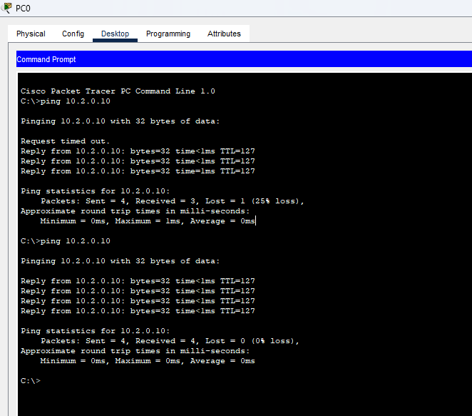
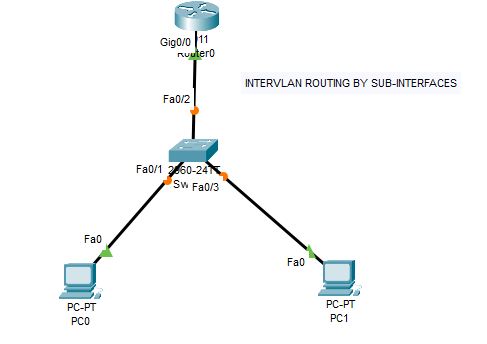
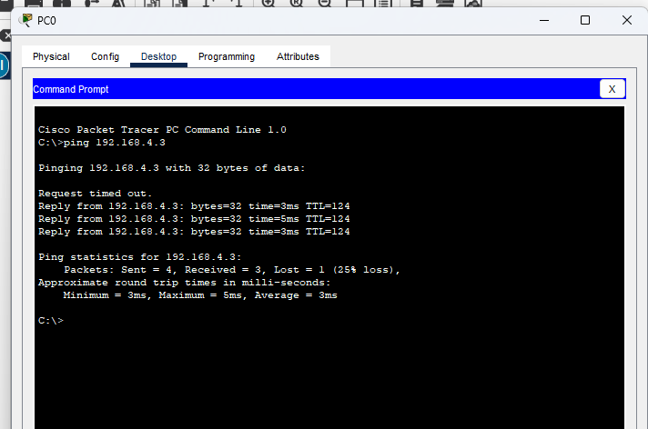
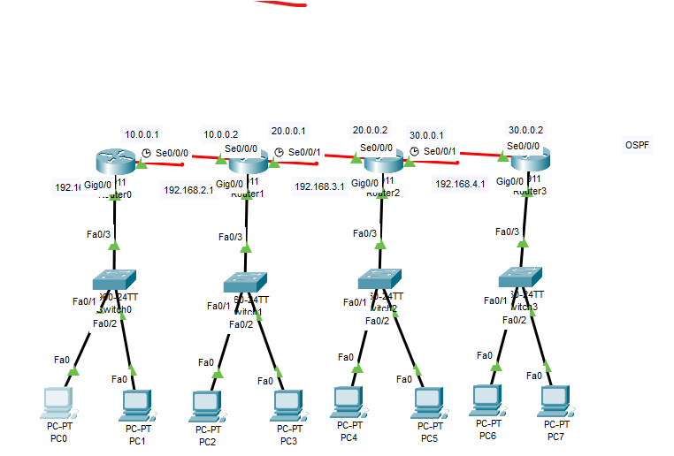

# 🚀 CCNA Networking Labs – Cisco Packet Tracer

<p align="center">
  
</p>

<p align="center">
  
</p>

<p align="center">
  
  
  
  
  
  
  
</p>

<p align="center">
  
  
  
</p>

---

## 📖 About This Repository

> **Welcome to my CCNA journey!**  
> This repository contains **hands-on Cisco Packet Tracer labs** covering essential networking topics for the **CCNA 200-301** certification.

✅ Realistic network topologies  
✅ Step-by-step configurations  
✅ Ping verification screenshots  
✅ Organized for easy review  

Perfect for **students, beginners, or anyone preparing for CCNA**.

---

## 🧰 Technologies & Tools Used

<p align="center">
  
  
  
  
</p>

- Cisco Packet Tracer v8+
- CLI for router/switch configuration
- Git & GitHub for version control

---

## 📡 Networking Concepts Covered

| Category | Topics |
|----------|--------|
| **Switching** | VLANs, Trunking, VTP, STP |
| **Routing** | Static Routing, OSPF, Default Routing |
| **Advanced** | Inter-VLAN Routing (Router-on-a-Stick), Sub-interfaces |
| **Services** | Telnet, SSH, DHCP, NAT |
| **Troubleshooting** | Ping, Traceroute, Show commands |

---

## 🗺️ Lab Topologies & Verification

<details>
<summary>📌 <b>VLAN Configuration Lab</b></summary>

**Topology**  


**Verification – Ping Test**  


</details>

<details>
<summary>📡 <b>Telnet Configuration Lab</b></summary>

**Topology**  


**Verification – Telnet Connectivity**  


</details>

<details>
<summary>🔀 <b>Inter-VLAN Routing (Router-on-a-Stick)</b></summary>

**Topology**  


**Verification – InterVLAN Ping**  


</details>

<details>
<summary>🌐 <b>OSPF Multi-Router Lab</b></summary>

**Topology**  


</details>

---

## ✅ Skills & Progress

| Technology | Status |
|------------|--------|
| VLANs | ✅ Completed |
| Inter-VLAN Routing | ✅ Completed |
| Static Routing | ✅ Completed |
| OSPF | ✅ Completed |
| Telnet Configuration | ✅ Completed |
| IP Addressing & Subnetting | ✅ Completed |
| Router & Switch Basics | ✅ Completed |
| Network Troubleshooting | ✅ Completed |

---

## 📈 Learning Journey

```mermaid
graph LR
A[Network Fundamentals] --> B[Switching & VLANs]
B --> C[Routing Concepts]
C --> D[OSPF]
D --> E[Inter-VLAN Routing]
E --> F[Telnet & Remote Access]
F --> G[Troubleshooting]
G --> H[CCNA Ready 🎯]
💡 Every lab is built from scratch – no pre-made files, only manual CLI configuration.

🚀 Future Improvements
Add SSH configuration labs

Implement DHCP & NAT scenarios

Create network automation scripts (Python + Netmiko)

Add Wireshark packet captures

Write detailed lab guides in /docs

💬 Networking Quote
"The art of networking is not just connecting devices, but connecting people and possibilities."
— Anonymous Network Engineer

🤝 Connect With Me
<p align="center"> <a href="https://github.com/yourusername"></a> <a href="https://linkedin.com/in/yourprofile"></a> <a href="mailto:youremail@example.com"></a> </p>
📜 License
This repository is for educational purposes only. Feel free to use, modify, and share with attribution.

<p align="center"> <b>Made with ❤️ by a CCNA Student</b><br> <sub>© 2026 – Lab by lab, closer to CCNA</sub> </p><p align="center">  </p> ```
